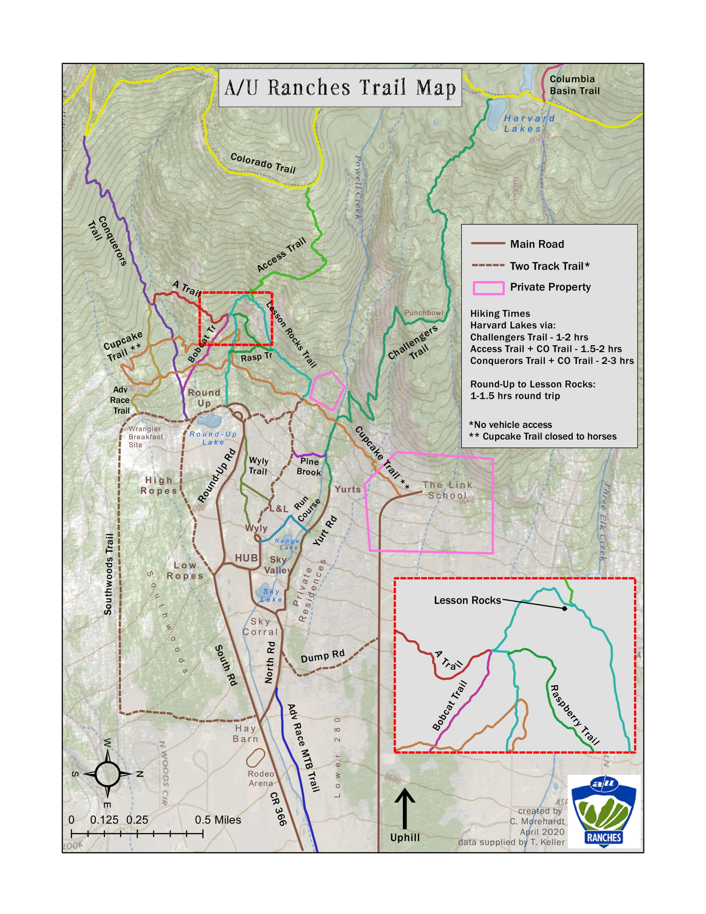

# Chandler's GIS Portfolio
I am a part-time student at Colorado Mountain College pursuing a GIS Advanced Certificate. I have a Bachelor's Degree in Structural Engineering from Cal Poly (2013) and have worked as an engineer, recruiter, and summer camp director since graduating. I learned about GIS through my work as an engineering recruitment consultant and figured it would be a great way to turn my passion for maps into a career. 
## GIS 101 Final project
I created a map for my current employer - Adventure Unlimited (aka A/U Ranches). I am a camp director for an 1,100 acre camp in Buena Vista, CO. We have a network of trails on property that guests are always getting lost on. I decided to use data from my Strava account as well as collaborating with our in-house forestry team to create a map that more accurately shows our trail network for hikers, bikers, runners, and horseback riders. 
# 
