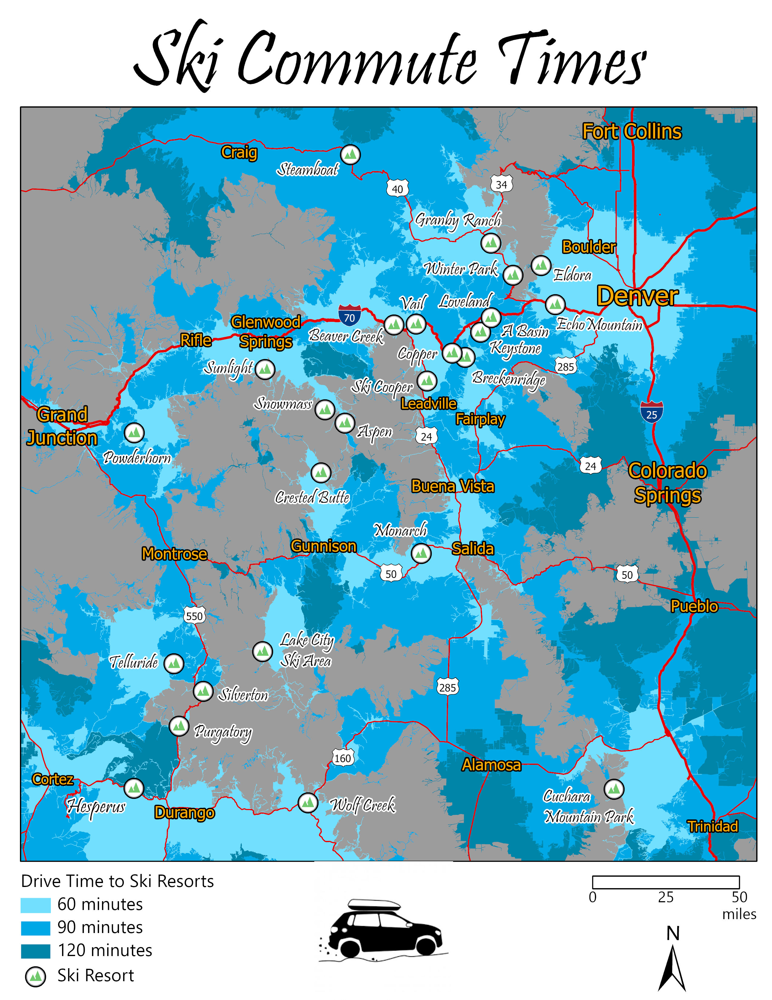
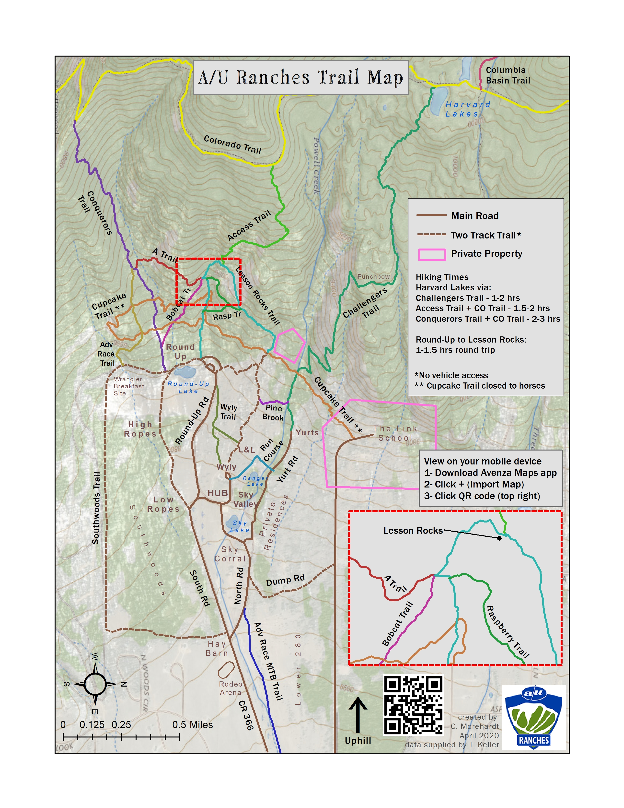
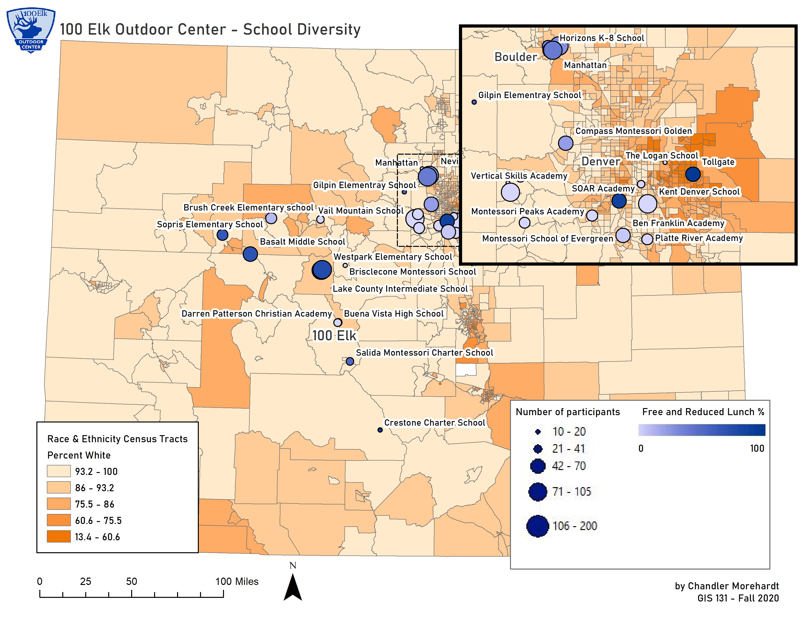
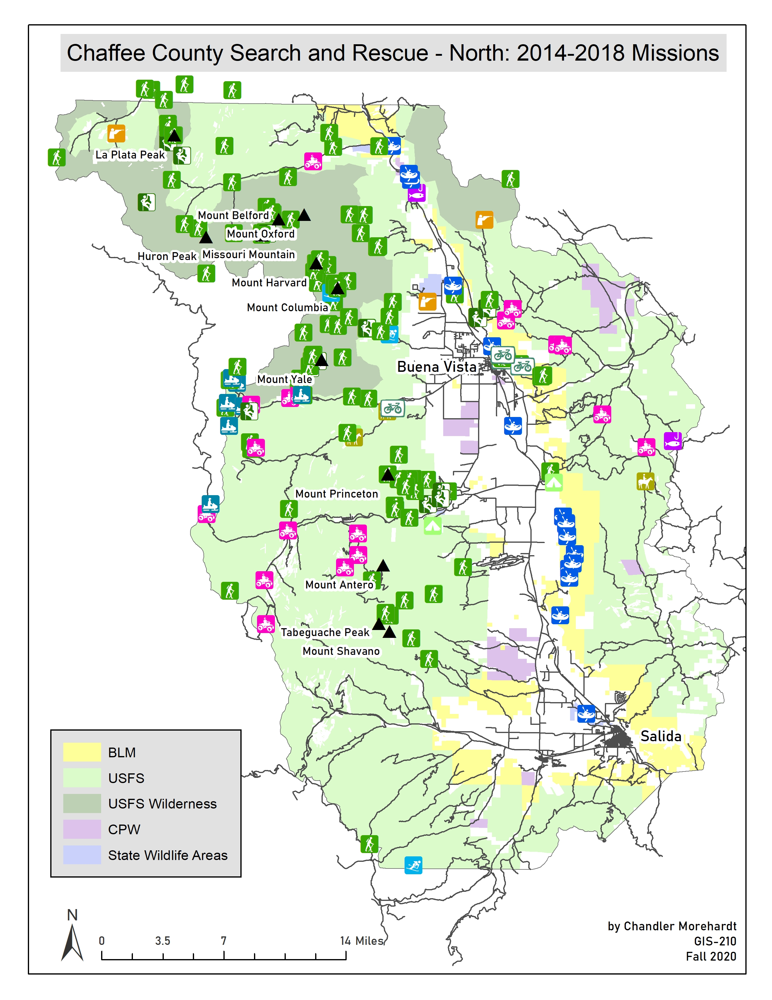
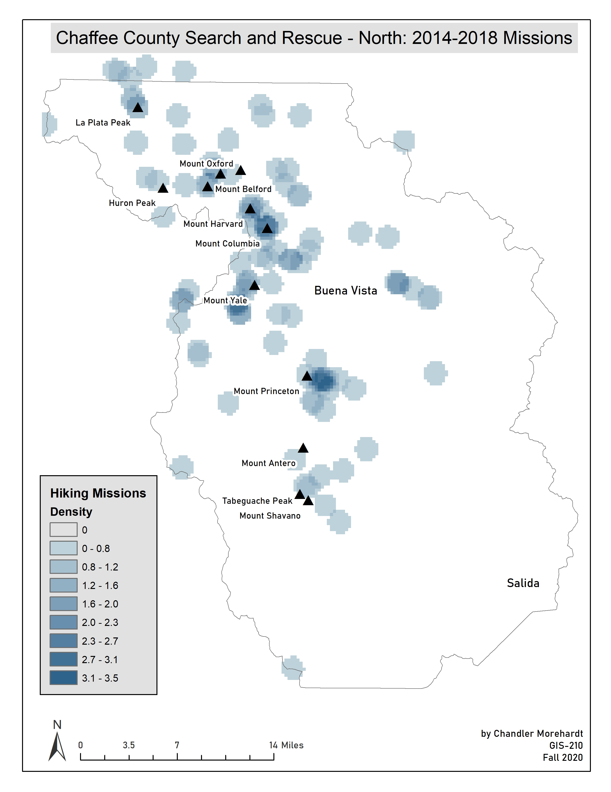
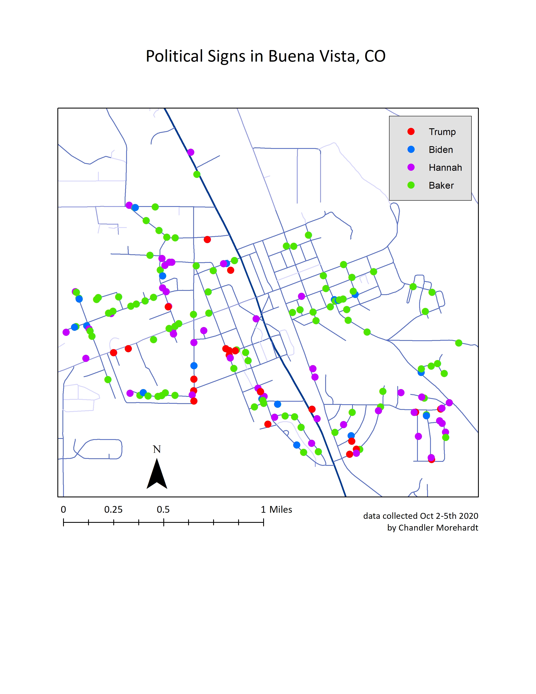
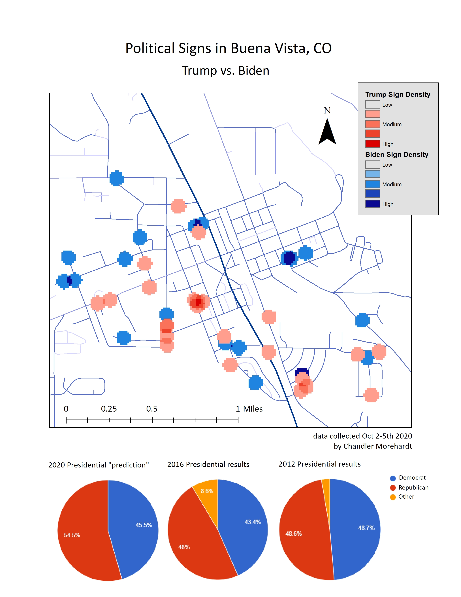
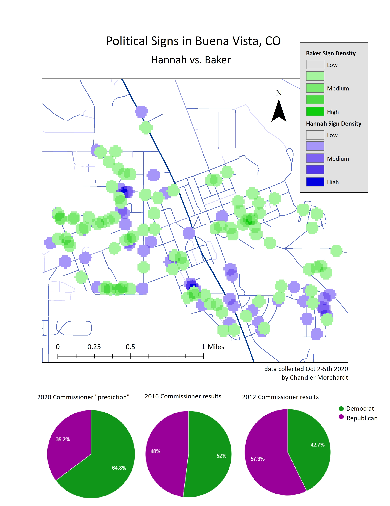

# Chandler's GIS Portfolio
I currently work for Summit County Government as a GIS Technician (since August 2022). Prior to that I completed my GIS Certificate at Colorado Mountain College. Below are some collections of my work. 
## Silverthorne Nordic Center

## Ski Commute Times
Final project for Cartography class showing the various commute times from different locations throughout Colorado. 

## A/U Ranches Trail Map
I created a map for my current employer - Adventure Unlimited (aka A/U Ranches). I am a camp director for an 1,100 acre camp in Buena Vista, CO. We have a network of trails on property that guests are always getting lost on. I used data from my Strava account as well as collaborating with our in-house forestry team to create a map that more accurately shows our trail network for hikers, bikers, runners, and horseback riders. 

## 100 Elk Outdoor Center - school diversity 
100 Elk Outdoor Center is an outdoor education program that is part of the organization I work for (Adventure Unlimited in Buena Vista, CO). 100 Elk hosts schools from Colorado and New Mexico in the spring and fall to come up and play in the mountains while taking lessons learned outside back to the classroom. The goal is this project is to map the schools that come to 100 Elk and analyze things like: What is the average income for each school district? What is the racial diversity of each school? 

## 13ers in Chaffee and Lake County
With the popularity of 14ers, I created a map showing 13ers in Chaffee and Lake County for those looking to escape the crowds. 

## Chaffee County Search and Rescue Mission Analysis
I joined the Chaffee County Search and Rescue – North (CCSAR-North) about a year ago and was curious to look at past years data to see if there are any trends that might be helpful in preventing future incidents. The audience for this map is primarily members of CCSAR-North but it could also be useful to recreation users in Chaffee County for people to know where incidents are happening. 

## COVID Business Status
During the Spring 2020 semester, our class focused on creating StoryMaps that would help members of our local community determine which businesses were open, open with restrictions, or closed. My StoryMap was featured in the Chaffee County Times and viewed more than 600 times. You can view it here: https://arcg.is/0zXe5G0 (has not been updated since June 2020)
## Political Signs in Buena Vista
I mapped the political signs around Buena Vista, CO, using ArcGIS Collector, a month before the 2020 Election to see if they are an accurate prediction of how Chaffee County will vote for both the national and local election. 

